# 📄 RAG Demo for Legal Demo

This project showcases the use of [`sdg_hub`](https://pypi.org/project/sdg-hub/) for generating synthetic queries and answer based on Bharatiya Nayay Sanhita (BNS) sections. 

The project processes Markdown (`.md`) files containing indivdual BNS sections, loads them into a dataset, and runs them through a configurable **query generation flow** using [`sdg_hub`](https://pypi.org/project/sdg-hub/) to generate queries and answers.

## 📦 Installation

- Install SDG_Hub
- Configuration
  - Create a .env file in the project root with your API key:

        RITS_API_KEY=your_api_key_here

## Folder Structure
```graphql
.
├── data/
│   └── bns_sections/      # Folder with BNS Sections
├── main.py                # Entry point
├── prompts/
│   ├── prompt_answer.yaml
│   ├── prompt_explanation_satisfactory.yaml
│   ├── prompt_scenario_relevant.yaml
│   ├── prompt_scenario.yaml
│   └── prompt_translate.yaml
├── query_generation.yaml  # Flow configuration file
└── README.md
```

## Usage

- Run the pipeline:
```
python main.py
```
This will:
- Load and parse .md files from data/bns_sections/.
- Initialize a flow from query_generation.yaml.
- Run the SDG HUB flow
- Save results to: `output/final_dir/legal.jsonl`

## Pipeline

```mermaid
sequenceDiagram
    participant Input as Input Dataset
    participant Scenario as Scenario Generation
    participant Explanation as Explanation Generation
    participant Relevance as Scenario Relevance Check
    participant Satisfaction as Explanation Satisfaction Check
    participant Output as Final Output

    Input ->> Scenario: document → generate_scenario
    Scenario ->> Explanation: build_explanation_prompt → generate_explanation
    Scenario ->> Relevance: build_scenario_relevant_prompt → generate_scenario_relevancy
    Explanation ->> Satisfaction: build_explanation_satisfactory_prompt → generate_explanation_satisfactory
    Relevance ->> Output: valid scenarios
    Satisfaction ->> Output: satisfactory explanations
```



## 🤝 Contributing
Contributions are welcome! Please open issues or submit PRs for improvements.